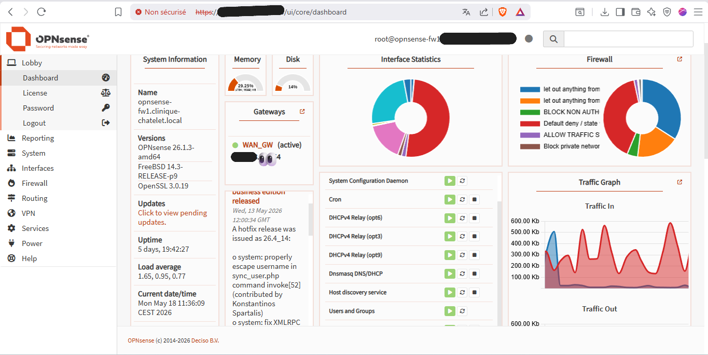
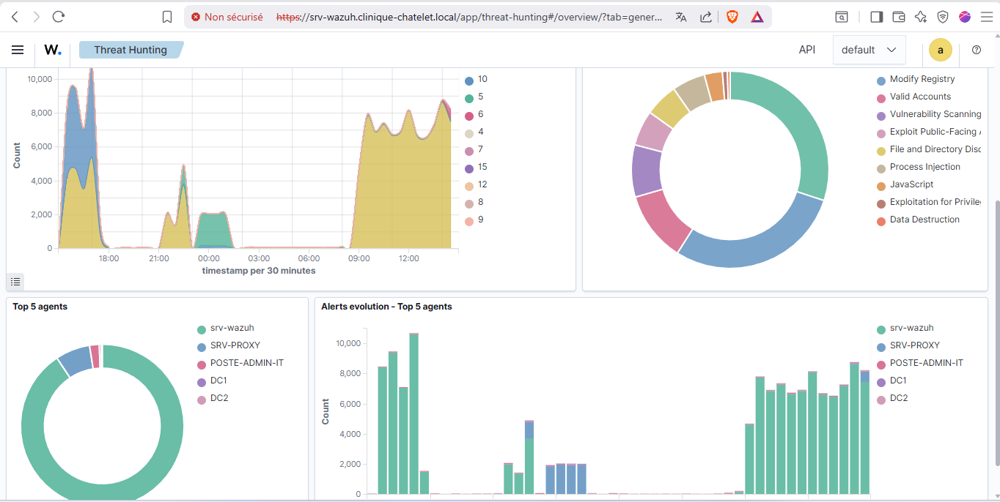
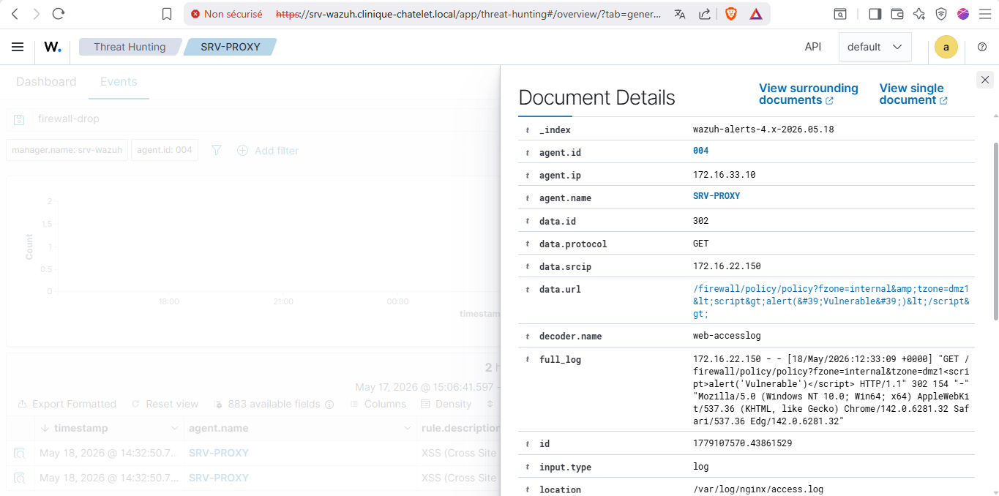
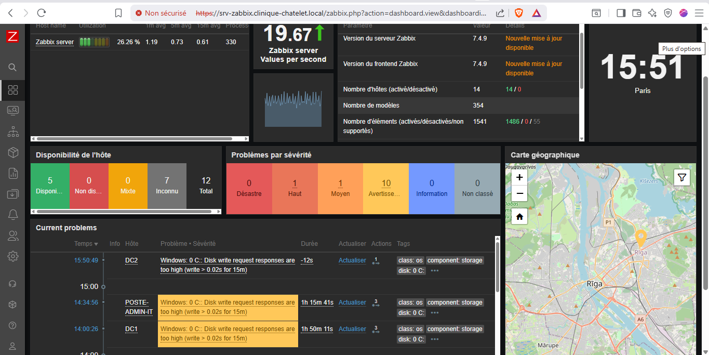
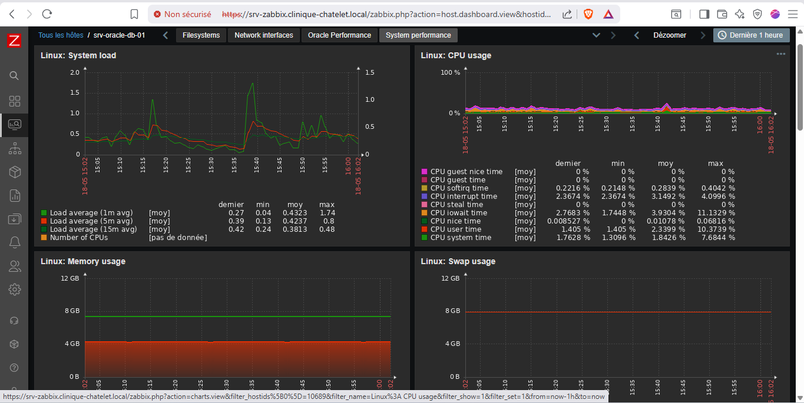
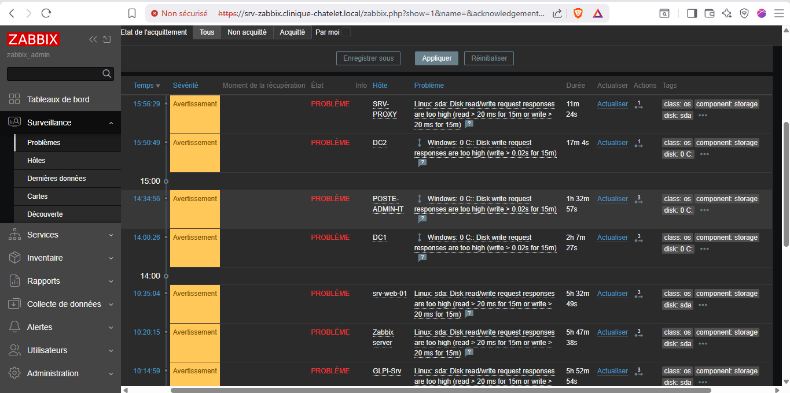

# 🏥 Clinique Le Châtelet — Infrastructure Sécurisée de Soins

**Infrastructure réseau segmentée et sécurisée pour la protection de données de santé (HDS/HIPAA)**
**Déployée sur VMware ESXi avec pare-feux HA, SIEM, MFA et réponse automatisée aux menaces**


-00A86B?style=flat-square)


---

*Projet de Master en Infrastructure Réseaux et Sécurité — Conçu, déployé et pentesté from scratch sur un hôte ESXi physique.*

---

## 🎯 Le Défi

Une clinique de rééducation fonctionnelle devait exposer son **application médicale Oracle monolithique** sur le Web, permettant aux soignants d'accéder à distance aux dossiers patients via un portail sécurisé tout en respectant les exigences **HDS** (Hébergement de Données de Santé) et en garantissant une **disponibilité de 99.99%**.

**Le problème :** Aucun pare-feu. Aucune segmentation. Aucune authentification. Des postes avec droits admin locaux. Le DNS pointant vers la box Internet. Une base Oracle directement accessible sur le LAN.

**La solution :** Une refonte complète de l'infrastructure avec défense en profondeur, micro-segmentation, basculement HA, MFA, SIEM avec règles de détection personnalisées, et confinement automatisé des menaces.

---

## 🏗️ Architecture

```
                         ┌──────────────┐
                         │   INTERNET   │
                         └──────┬───────┘
                                │
                         ┌──────┴───────┐
                         │  Sophos UTM  │
                         │  WAN VLAN 65 │
                         └──────┬───────┘
                                │
                ┌───────────────┴───────────────┐
                │    Cluster HA OPNsense         │
                │  ┌─────────┐   ┌─────────┐    │
                │  │  FW1    │◄─►│  FW2    │    │
                │  │ MASTER  │pf │ BACKUP  │    │
                │  │  Sync   │   │         │    │
                │  └─────────┘   └─────────┘    │
                │     6 VIPs CARP (.254)         │
                └───────────────┬───────────────┘
                                │
                        Trunk 802.1Q (VGT 4095)
                                │
          ┌─────────┬───────────┼───────────┬──────────┐
          │         │           │           │          │
    ┌─────┴─────┐ ┌─┴───────┐ ┌┴────────┐ ┌┴───────┐ ┌┴────────┐
    │ VLAN 111  │ │VLAN 333 │ │VLAN 444 │ │VLAN 555│ │VLAN 999 │
    │   SRV     │ │  DMZ    │ │ BACKUP  │ │ GUEST  │ │  MGMT   │
    │───────────│ │─────────│ │─────────│ │────────│ │─────────│
    │ DC1 + DC2 │ │ Nginx   │ │ Veeam   │ │Isolé   │ │ Bastion │
    │ Oracle 21c│ │Authelia │ │ B&R 13  │ │Internet│ │Admin IT │
    │ Zabbix    │ │Appli Web│ │         │ │  seul  │ │BitLocker│
    │ Wazuh     │ │Mailpit  │ │         │ │        │ │ 9 GPOs  │
    │ GLPI      │ │         │ │         │ │        │ │         │
    └───────────┘ └─────────┘ └─────────┘ └────────┘ └─────────┘
     172.16.11.0   172.16.33.0 172.16.44.0 172.16.55.0 172.16.99.0
```

> **Architecture hybride Router-on-a-Stick + Access Ports** sur VMware ESXi 7.0 U2 — Les firewalls gèrent le tagging 802.1Q via VLAN 4095 (VGT), tandis que toutes les autres VMs sont connectées à des groupes de ports access dédiés.

---

## 📊 Métriques Clés

| Composant | Métrique | Valeur |
|---|---|---|
| **OPNsense** | Règles firewall (pfctl) | **208 règles** en 19 sections |
| | Alias (object-groups) | **35 alias** (hôtes, réseaux, ports) |
| | VIPs CARP | **6 VHIDs** — basculement transparent |
| | États actifs | 1 166 connexions simultanées |
| **Wazuh** | Règles de détection HDS custom | **35 règles** (200000→200501) |
| | Agents actifs | **12 endpoints** (4 familles d'OS) |
| | Alertes collectées | **92 488** |
| | Active Responses automatisées | **8 règles de confinement** |
| **Zabbix** | Hôtes supervisés | **14** (dual-stack sur les firewalls) |
| | Items actifs | **20 088** |
| | Triggers actifs | **7 728** |
| | Débit | **19,67 valeurs/seconde** |
| **Infrastructure** | Machines virtuelles ESXi | **13 VMs** |
| | Segments VLAN | **6 zones isolées** |
| | Utilisateurs protégés MFA | **6 comptes** (TOTP) |
| | Ratio compression backup | **5,5x** (80 Go en 36 min) |

---

## 🛡️ Stack Sécurité

### Pare-feu — Cluster HA OPNsense

Deux OPNsense 26.1.3 en cluster actif/passif CARP avec synchronisation d'état pfSync sur un lien dédié. Politique Default Deny sur toutes les interfaces avec anti-spoofing, anti-bogons (RFC1918 + RFC6598) et tables dynamiques de blocage (`sshlockout`, `virusprot`).

➡️ [Règles pfctl annotées](configs/opnsense/fw1-rules-annotated.conf) · [Matrice de flux complète](docs/assets/diagrams/flux-matrix.md) · [Inventaire des alias](configs/opnsense/aliases-inventory.md) · [Documentation HA CARP](configs/opnsense/carp-ha-config.md)

### SIEM — Wazuh XDR avec règles HDS personnalisées

35 règles de détection personnalisées organisées en 11 catégories, mappées sur les frameworks **PCI DSS**, **HIPAA** et **MITRE ATT&CK**. Active Response bloque les menaces en temps réel via `firewall-drop` (Linux), `pf` (FreeBSD/OPNsense) et `netsh` (Windows).

| Catégorie | Règles | Exemples |
|---|---|---|
| Authentification | 200000–200007 | Brute force SSH/AD, connexion root, accès hors heures |
| Élévation de privilèges | 200050–200054 | sudo, modification groupes AD, cycle de vie des comptes |
| Anti-forensics | 200100–200101 | Effacement logs Windows (T1070.001), Pass-the-Hash (T1550.002) |
| Intégrité fichiers (FIM) | 200150–200160 | Falsification configs, **détection extensions ransomware** |
| Réseau / Firewall | 200200–200212 | Détection scan, intrusion VLAN BACKUP, brute force VPN |
| Backup Veeam | 200350–200352 | Échecs backup, backup Oracle critique |
| Base Oracle | 200400–200402 | Erreurs ORA-, ORA-00600 interne, échecs connexion |
| Disponibilité | 200500–200501 | Service arrêté, reboot/shutdown système |

➡️ [Règles custom XML](configs/wazuh/local_rules.xml) · [Documentation SIEM](configs/wazuh/wazuh-siem-documentation.md) · [Config manager](configs/wazuh/ossec.conf)

### Supervision — Zabbix 7.4.9

14 hôtes supervisés sur tous les VLANs avec observation dual-stack sur les firewalls (agent Zabbix + SNMP). La base Oracle dispose de 213 items dédiés avec dashboards de performance personnalisés. Alertes email routées via relais SMTP Mailpit dans la DMZ.

➡️ [Documentation monitoring](configs/zabbix/zabbix-monitoring-documentation.md) · [Export templates](configs/zabbix/zabbix_custom-templates.yaml)

### Contrôle d'accès — MFA partout

| Chemin d'accès | Authentification | Technologie |
|---|---|---|
| Portail web (dossiers patients) | Identifiant + TOTP | Authelia v4.39.15 via Nginx forward-auth |
| VPN (soignants distants) | LDAP + TOTP | OpenVPN + OPNsense OTP seeds |
| Console admin (OPNsense) | Local + TOTP | MFA intégré OPNsense |
| Connexion domaine | Kerberos + GPO | Active Directory (Windows Server 2022) |

### Sauvegarde et Reprise — Veeam B&R 13

VLAN 444 sanctuarisé avec accès restreint. Backup complet Oracle : **80 Go compressés à 14,5 Go** (ratio 5,5x) en 36 minutes avec VMware CBT (Changed Block Tracking).

---

## 🔬 Résultats du Pentest

Audit de sécurité offensif réalisé depuis **Kali Linux** positionné dans le VLAN GUEST (555) — zéro connaissance préalable du SI.

| Test | Résultat | Preuve |
|---|---|---|
| Accessibilité VLANs internes depuis GUEST | ❌ **0 hôte visible** | Tout le RFC1918 bloqué au firewall |
| Scan de ports gateway (65 535 ports) | ❌ **Tous filtrés** | Aucun service exposé sur la gateway |
| DNS vers DCs internes depuis GUEST | ❌ **Bloqué** | Isolation DNS complète |
| VLAN hopping (double-tag 802.1Q) | ❌ **Bloqué** | Trunk uniquement sur interfaces firewall |
| DNS tunneling (exfiltration Base64) | ❌ **Timeout** | Pas de forwarding DNS depuis GUEST |
| Détection proxy ouvert (3128, 8080) | ❌ **Timeout** | Aucun proxy ouvert |
| XSS/Path traversal sur portail DMZ | 🔔 **Détecté par Wazuh** | Rule 31153 + Active Response déclenché |
| Scan réseau (Kali → interne) | 🔔 **Détecté et Bloqué** | Rule 200200 → firewall-drop |

---

## 📋 Conformité

| Référentiel | Périmètre | Contrôles implémentés |
|---|---|---|
| **HDS** (FR) | Hébergement données de santé | Segmentation réseau, chiffrement, contrôle d'accès, journalisation, backup |
| **ISO 27001** | Sécurité de l'information | Analyse de risques, contrôles SMSI, réponse à incident, continuité |
| **RGPD Art. 32** | Protection des données | Pseudonymisation, chiffrement, disponibilité, résilience, tests réguliers |
| **PCI DSS** | Cartes de paiement (méthodologie) | Config firewall, deny par défaut, surveillance logs, gestion vulnérabilités |
| **HIPAA** | Données de santé (US, méthodologie) | Contrôle d'accès, audit, intégrité, sécurité des transmissions |

---

## 🗂️ Structure du Dépôt

```
├── configs/
│   ├── opnsense/          # Règles firewall, alias, HA CARP, NAT (anonymisées)
│   ├── wazuh/             # Règles SIEM, config manager, config agents
│   ├── zabbix/            # Templates monitoring, documentation
│   ├── nginx/             # Reverse proxy + Authelia forward-auth (à venir)
│   ├── authelia/          # Configuration MFA (à venir)
│   └── gpo/               # Inventaire GPO Active Directory (à venir)
│
├── docs/
│   ├── assets/
│   │   ├── screenshots/   # Preuves anonymisées du lab
│   │   └── diagrams/      # Matrice de flux, schémas d'architecture
│   └── ...                # DATs par mission (à venir)
│
├── scripts/               # Scripts d'automatisation et d'audit (à venir)
├── compliance/            # Matrices de conformité ISO/HDS/RGPD (à venir)
└── mkdocs.yml             # Config du site de documentation (GitHub Pages)
```

---

## 🛠️ Stack Technique

| Couche | Technologie | Rôle |
|---|---|---|
| Hyperviseur | VMware ESXi 7.0 U2 | Hébergement VMs, vSwitch, groupes de ports |
| Pare-feu | OPNsense 26.1.3 (FreeBSD 14.3) | Cluster HA, CARP, pfSync, OpenVPN, NAT |
| Annuaire | Windows Server 2022 (AD DS) | Kerberos, DNS, DHCP, GPO, FSMO |
| SIEM/XDR | Wazuh v4.14.4 | FIM, Active Response, règles custom, détection CVE |
| Supervision | Zabbix 7.4.9 | Agent + SNMP, triggers, alertes email |
| Portail MFA | Authelia v4.39.15 + Nginx | Forward-auth, TOTP, backend LDAPS |
| Base de données | Oracle 21c (Oracle Linux 9) | Dossiers patients (niveau HDS) |
| Sauvegarde | Veeam B&R 13.0.1 | Agentless VMware, CBT, compression 5,5x |
| ITSM | GLPI 10.0.15 | Ticketing, gestion d'assets, sync LDAP |
| Alertes | Mailpit | Relais SMTP pour notifications Zabbix + Wazuh |
| Accès distant | OpenVPN + Tailscale | Tunnel VPN (MFA) + management OOB |
| Poste admin | Windows 10 Pro 22H2 | BitLocker, UAC max, Defender NIS, 9 GPOs |

---

## 📸 Captures d'écran

**OPNsense — Cluster HA Firewall**

| Dashboard | Statut CARP (FW1 MASTER) | Statut CARP (FW2 BACKUP) |
|---|---|---|
|  |  |  |

**Wazuh — SIEM / XDR**

| Vue globale (11 agents) | Threat Hunting (MITRE) | Active Response (XSS détecté) |
|---|---|---|
|  |  |  |

**Zabbix — Supervision**

| Dashboard (14 hôtes) | Performance Oracle | Alertes en cours |
|---|---|---|
|  |  |  |

---

## 🚀 Ce que ce projet m'a appris

- **La défense en profondeur** n'est pas un buzzword, chaque couche (firewall → segmentation → MFA → SIEM → backup) détecte des menaces que les autres laissent passer
- **Des règles SIEM personnalisées** alignées sur des référentiels de conformité transforment un SIEM d'un agrégateur de logs en un véritable moteur de détection
- **Pentester sa propre infrastructure** révèle des angles morts qu'une revue de configuration ne peut pas trouver
- **La documentation est un contrôle de sécurité** — si ce n'est pas documenté, ça n'existe pas pour les auditeurs

---

## 📄 Licence

Ce projet est publié sous [licence MIT](LICENSE). Les fichiers de configuration sont anonymisés; aucun secret, credential ou donnée patient réelle n'est inclus dans ce dépôt.

---

**Construit avec 🔒 par Yemah**

*Master 2 — Infrastructure Réseaux et Sécurité*

[](https://linkedin.com/in/steeve-womo)
