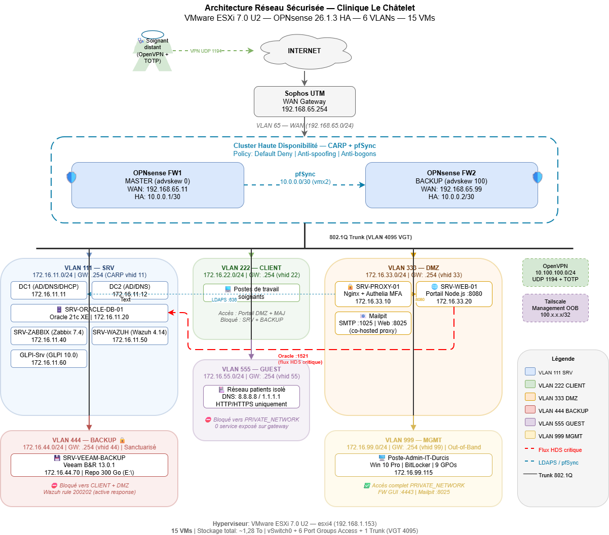

># 🏗️ Architecture Globale

L'infrastructure est déployée sur **VMware ESXi 7.0 U2** avec une architecture **hybride Router-on-a-Stick + Access Ports**.

---

## Plan d'Adressage

| VLAN | Nom | Réseau | Passerelle CARP | Rôle |
|---|---|---|---|---|
| 111 | SRV | 172.16.11.0/24 | .254 (vhid 11) | Serveurs métier, BDD, SIEM, AD |
| 222 | CLIENT | 172.16.22.0/24 | .254 (vhid 22) | Postes de travail soignants |
| 333 | DMZ | 172.16.33.0/24 | .254 (vhid 33) | Services exposés Internet |
| 444 | BACKUP | 172.16.44.0/24 | .254 (vhid 44) | Veeam — accès restreint |
| 555 | GUEST | 172.16.55.0/24 | .254 (vhid 55) | Réseau patients isolé |
| 999 | MGMT | 172.16.99.0/24 | .254 (vhid 99) | Administration Out-of-Band |

## Inventaire ESXi (15 VMs)

| VM | Taille | OS | VLAN | Backup |
|---|---|---|---|---|
| DC1 | 68 Go | Windows Server 2019 | SRV | ✅ |
| DC2 | 68 Go | Windows Server 2019 | SRV | ✅ |
| SRV-ORACLE-DB-01 | 94 Go | Oracle Linux 9 | SRV | ✅ |
| SRV-ZABBIX | 108 Go | Ubuntu 22.04 | SRV | ✅ |
| SRV_WAZUH | 116 Go | Ubuntu 22.04 | SRV | ✅ |
| GLPI Serveur | 68 Go | Ubuntu 22.04 | SRV | ✅ |
| OPNsense-FW1 | 66 Go | FreeBSD 13 | trunk | ✅ |
| OPNsense-FW2 | 46 Go | FreeBSD 13 | trunk | ✅ |
| SRV-PROXY-01 | 54 Go | Ubuntu 22.04 | DMZ | ✅ |
| SRV-WEB-01 | 54 Go | Ubuntu 22.04 | DMZ | ✅ |
| SRV-VEEAM-BACKUP | 310 Go | Windows Server 2019 | BACKUP | — |
| Poste-Admin-IT | 68 Go | Windows 10 Pro | MGMT | — |
| Kali-Audit-Test | 34 Go | Debian 11 | GUEST | — |

➡️ **[Matrice de flux inter-VLAN](flux-matrix.md)**
