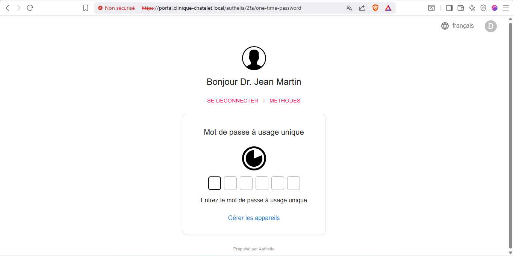

# 🔐 DMZ & MFA — Nginx + Authelia

Reverse proxy Nginx avec forward-auth Authelia v4.39.15. TOTP obligatoire. Backend LDAPS vers AD.

## Flux d'Authentification

```
Navigateur → Nginx (443) → Authelia (TOTP) → SRV-WEB (8080) → Oracle (1521)
                                │
                                ▼
                           DC1 LDAPS:636
```

1. GET / → auth_request → pas de session → redirect /authelia
2. POST credentials → LDAPS verify via DC1:636 → ✅
3. TOTP prompt → code 6 digits → ✅
4. Cookie `authelia_session` → redirect portail
5. proxy_pass → SRV-WEB:8080 → Oracle:1521

## Configuration Authelia

| Paramètre | Valeur |
|---|---|
| Policy par défaut | **deny** |
| Policy portail | **two_factor** obligatoire |
| TOTP | SHA1, 6 digits, 30 sec |
| Backend | LDAPS (TLS 1.2 min, skip_verify=false) |
| Sessions | SQLite, 8h expiration, 1h inactivité |

## Fichiers

| Fichier | Description |
|---|---|
| [`dmz-documentation.md`](https://github.com/Yemah/clinique-chatelet-secure-infra/blob/main/configs/nginx/dmz-documentation.md) | Documentation DMZ complète |
| [`portal-clinique-chatelet.conf`](https://github.com/Yemah/clinique-chatelet-secure-infra/blob/main/configs/nginx/portal-clinique-chatelet.conf) | Vhost Nginx |
| [`authelia-location.conf`](https://github.com/Yemah/clinique-chatelet-secure-infra/blob/main/configs/nginx/authelia-location.conf) | Snippet forward-auth |
| [`configuration.yml`](https://github.com/Yemah/clinique-chatelet-secure-infra/blob/main/configs/authelia/configuration.yml) | Config Authelia |


