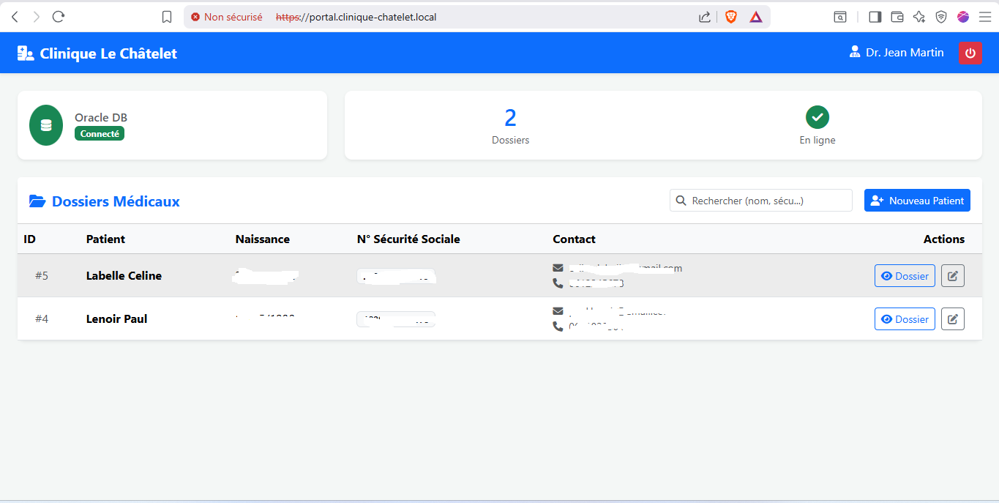

# 🗄️ Oracle 21c & Portail Médical

Oracle 21c XE sur Oracle Linux 9. Tablespace dédié `CLINIQUE_DATA` (1 Go). Application Node.js sur port 8080.

## Instance Oracle

| Paramètre | Valeur |
|---|---|
| Version | Oracle 21c XE (21.3.0.0.0) |
| Instance | XE — status OPEN |
| Listener | TCP 1521, uptime 7+ jours |
| audit_trail | **DB** (conforme HDS) |
| Comptes ouverts | 2 (CLINIQUE_APP + C##ZBX_MONITOR) |
| Comptes verrouillés | 16 (tous les comptes Oracle par défaut) |

## Tablespaces

| Tablespace | Taille | Fonction |
|---|---|---|
| **CLINIQUE_DATA** | **1 024 Mo** | Données patients HDS |
| SYSTEM | 1 360 Mo | Dictionnaire Oracle |
| SYSAUX | 1 020 Mo | Composants auxiliaires |
| UNDOTBS1 | 120 Mo | Segments d'annulation |

## Fichiers

| Fichier | Description |
|---|---|
| [`oracle-application-documentation.md`](https://github.com/Yemah/clinique-chatelet-secure-infra/blob/main/configs/oracle/oracle-application-documentation.md) | Architecture applicative complète |
| [`oracle-audit.txt`](https://github.com/Yemah/clinique-chatelet-secure-infra/blob/main/configs/oracle/oracle-audit.txt) | Audit instance + tablespaces |
| [`oracle-listener.txt`](https://github.com/Yemah/clinique-chatelet-secure-infra/blob/main/configs/oracle/oracle-listener.txt) | Listener status |

