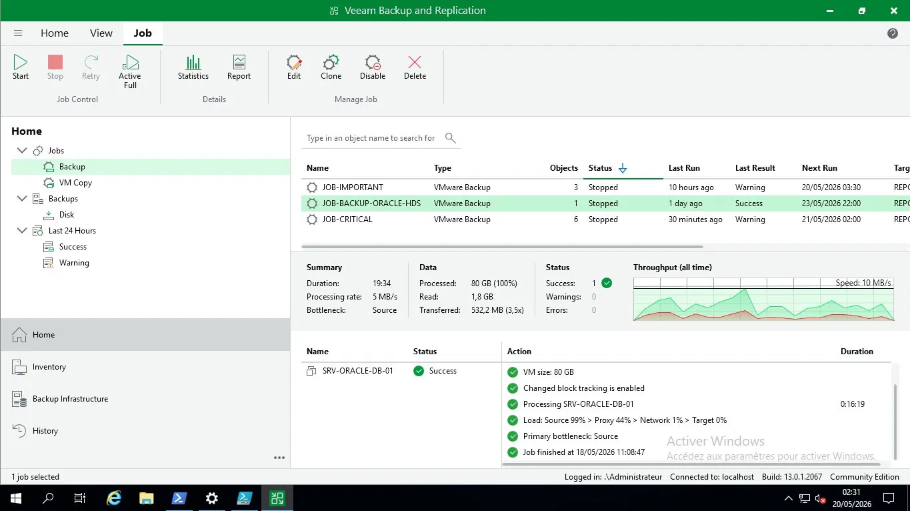

# 💾 Backup & PRA — Veeam B&R 13

VLAN 444 sanctuarisé. Repository 300 Go. 3 jobs planifiés. 15 VMs inventoriées, toutes "Clean".

## Jobs

| Job | Objets | Résultat | Planification |
|---|---|---|---|
| **JOB-BACKUP-ORACLE-HDS** | 1 | ✅ Success | Bi-hebdo |
| JOB-IMPORTANT | 3 | ⚠️ Warning | Quotidien |
| JOB-CRITICAL | 6 | ⚠️ Warning | Quotidien |

## Oracle HDS Backup (détail)

| Métrique | Valeur |
|---|---|
| VM | SRV-ORACLE-DB-01 (80 Go) |
| Données lues (CBT) | 1,8 Go |
| Transféré | 532 Mo (3,5x compression) |
| Durée | 16 min 19 s |
| CBT | ✅ Activé |

## PRA

| Métrique | Objectif | Réalisé |
|---|---|---|
| RPO | < 24h | ✅ |
| RTO | < 4h | ✅ (~20 min Oracle) |

| Scénario | Reprise |
|---|---|
| Perte Oracle | Restauration VM ~20 min |
| Perte DC1 | DC2 + seizure FSMO ~30 min |
| Perte FW1 | CARP auto → FW2 ~3 sec |
| Ransomware | Isolation + restauration clean |

➡️ [`veeam-pra-documentation.md`](https://github.com/Yemah/clinique-chatelet-secure-infra/blob/main/configs/veeam/veeam-pra-documentation.md)

