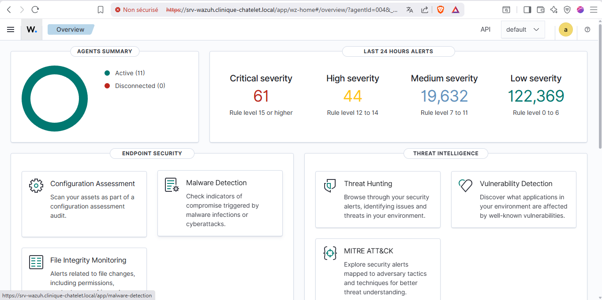

# 🔍 SIEM — Wazuh v4.14.4

12 agents, 92 488 alertes, 35 règles custom HDS, 8 Active Responses automatisées.

## Agents (12 endpoints)

| ID | Nom | OS | VLAN |
|---|---|---|---|
| 000 | srv-wazuh (manager) | Ubuntu 22.04 | SRV |
| 001 | POSTE-ADMIN-IT | Windows 10 | MGMT |
| 002 | DC1 | Windows Server 2019 | SRV |
| 003 | srv-zabbix | Ubuntu 22.04 | SRV |
| 004 | SRV-PROXY | Ubuntu 22.04 | DMZ |
| 005 | SRV-ORACLE-DB | Oracle Linux | SRV |
| 006 | SRV-WEB | Ubuntu 22.04 | DMZ |
| 007 | DC2 | Windows Server 2019 | SRV |
| 008 | SRV-VEEAM-BACKUP | Windows Server | BACKUP |
| 009 | OPNsense-FW2 | FreeBSD | trunk |
| 013 | opnsense-fw1 | FreeBSD | trunk |
| 014 | glpi-srv | Ubuntu 22.04 | SRV |

## Règles Custom (35)

| Catégorie | IDs | Exemples |
|---|---|---|
| Authentification | 200000–200007 | Brute force SSH/AD, root login, hors heures, Authelia |
| Élévation privilèges | 200050–200054 | sudo, groupes AD, comptes |
| Anti-forensics | 200100–200101 | Log clearing (T1070.001), Pass-the-Hash (T1550.002) |
| FIM | 200150–200160 | Tampering configs, **extensions ransomware** |
| Réseau | 200200–200212 | Scan, intrusion BACKUP, brute force VPN |
| Tuning | 200250–200260 | Réduction bruit Zabbix/Oracle/multicast |
| Backup/Oracle/Dispo | 200300–200501 | Échecs backup, ORA-00600, service arrêté |

## Active Response

| Règle déclencheur | Commande | Timeout | Cible |
|---|---|---|---|
| 200000 (SSH BF) | `firewall-drop` | 360s | Linux |
| 200007 (Authelia BF) | `firewall-drop` | 300s | SRV-PROXY |
| 200200 (Scan réseau) | `pf` | 600s | OPNsense |
| 200202 (BACKUP intrusion) | `pf` | 3600s | OPNsense |
| 200160 (Ransomware) | `win_route-null` | 14400s | Windows |

## Fichiers

| Fichier | Description |
|---|---|
| [`local_rules.xml`](https://github.com/Yemah/clinique-chatelet-secure-infra/blob/main/configs/wazuh/local_rules.xml) | 35 règles HDS (PCI DSS, HIPAA, MITRE) |
| [`ossec.conf`](https://github.com/Yemah/clinique-chatelet-secure-infra/blob/main/configs/wazuh/ossec.conf) | Configuration manager |
| [`agent-conf-default.xml`](https://github.com/Yemah/clinique-chatelet-secure-infra/blob/main/configs/wazuh/agent-conf-default.xml) | Config agents partagée |
| [`wazuh-siem-documentation.md`](https://github.com/Yemah/clinique-chatelet-secure-infra/blob/main/configs/wazuh/wazuh-siem-documentation.md) | Documentation complète |

